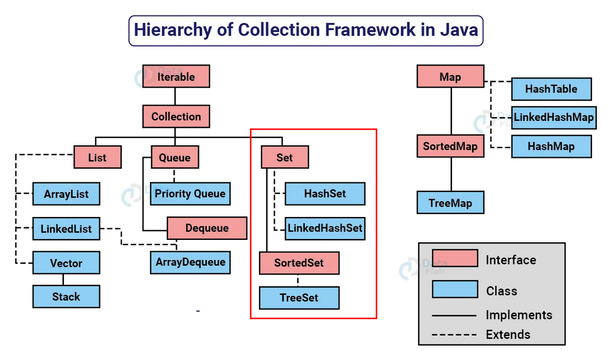

## GENERICS TYPE

- Um tipo genérico é uma classe genérica ou uma interface que é parametrizada em relação a tipos.
- A classe Box a seguir será modificada para demonstrar o conceito:

```
public class Box {
    private Object object;

    public void set(Object object) { this.object = object; }
    public Object get() { return object; }
}
```

- O símbolo `<>`é chamado de "diamond" ou "diamond operator" foi um recurso introduzido no Java 7 e é usado no contexto de tipos genéricos em Java para inferir automaticamente o tipo com base no contexto.
- Para atualizar a classe `Box`para usar generics, você cria uma declaração de tipo genérico alterando o código `public class Box` para `public class Box<T>`.

Isso introduz a variável de tipo, T, que pode ser usada em qualquer lugar dentro da classe:

```
/**
Versão genérica da classe Box.
@param <T> o tipo do valor sendo armazenado
*/
public class Box<T> {
	// T representa "Type" (tipo)
    private T t;

    public void set(T t) { this.t = t; }
    public T get() { return t; }
}
```

- Como você pode ver, todas as ocorrências de Object são substituídas por T.
- Uma variável de tipo pode ser qualquer tipo não primitivo que você especificar: qualquer tipo de classe, qualquer tipo de interface, qualquer tipo de array ou até mesmo outra variável de tipo.
- Essa mesma técnica pode ser aplicada para criar interfaces genérica.
- Os nomes de parâmetros de tipo mais comumente usados são:
  - E - Elemento (usado extensivamente pelo Java Collections Framework)
  - K - Chave
  - N - Número
  - T - Tipo
  - V - Valor
  - S, U, V, etc. - 2º, 3º, 4º tipos

### Vantagens simples de usar generics nas interfaces Collection em Java:

1. Segurança do tipo de dados: O uso de generics garante que apenas objetos de um tipo específico possam ser adicionados à coleção, evitando erros de tipo e garantindo que você esteja lidando com os dados corretos.
2. Código mais legível: Ao usar generics, você pode especificar o tipo de dados esperado ou retornado pela coleção, o que torna o código mais fácil de entender e ler.
3. Detecta erros mais cedo: O compilador verifica se você está usando os tipos corretos durante a compilação, ajudando a identificar erros de tipo antes mesmo de executar o programa.
4. Reutilização de código: Com generics, você pode criar classes e métodos genéricos que funcionam com diferentes tipos de coleções, evitando a necessidade de duplicar código para cada tipo específico.
5. Melhor desempenho: O uso de generics pode melhorar o desempenho, pois evita a necessidade de conversões de tipo desnecessárias e permite que o compilador otimize o código com base no tipo especificado.

## Comparable X Comparator

### Comparable

- Comparable fornece uma única sequência de ordenação. Em outras palavras, podemos ordenar a coleção com base em um único elemento, como id, nome e preço.
- Comparable afeta a classe original, ou seja, a classe atual é modificada.
- Comparable fornece o método compareTo() para ordenar elementos.
- Comparable está presente no pacote java.lang.
- Podemos ordenar os elementos da lista do tipo Comparable usando o método Collections.sort(List).

### Comparator

- O Comparator fornece o método compare() para ordenar elementos.
- O Comparator fornece múltiplas sequências de ordenação. Em outras palavras, podemos ordenar a coleção com base em múltiplos elementos, como id, nome, preço, etc.
- O Comparator não afeta a classe original, ou seja, a classe atual não é modificada.
- Um Comparator está presente no pacote java.util.
- Podemos ordenar os elementos da lista do tipo Comparator usando o método Collections.sort(List, Comparator).

### Collections

- A classe Collections é uma classe utilitária do Java para operações comuns em coleções.
- Ela fornece métodos para ordenação, busca, manipulação e sincronização de coleções.
- O método sort() é usado para ordenar uma lista em ordem ascendente.
- O método sort() em conjunto com Collections.reverseOrder() permite ordenar em ordem descendente.

```
package main.java.comparableXcomparator;

import java.util.Comparator;

// Uma classe 'Livro' que implementa Comparable
class Livro implements Comparable<Livro> {
	private String titulo;
	private String autor;
	private int ano;

	// Construtor
	public Livro(String ti, String au, int an) {
		this.titulo = ti;
		this.autor = au;
		this.ano = an;
	}

	// Usado para ordenar livros por ano
	public int compareTo(Livro l) {
		return titulo.compareTo(l.titulo);
	}

	// Métodos getters para acessar os dados privados
	public String getTitulo() {
		return titulo;
	}

	public String getAutor() {
		return autor;
	}

	public int getAno() {
		return ano;
	}
}

// Classe para comparar Livro por autor
class CompararAutor implements Comparator<Livro> {
  @Override
  public int compare(Livro l1, Livro l2) {
		return l1.getAutor().compareTo(l2.getAutor());
	}
}

// Classe para comparar Livro por ano
class CompararAno implements Comparator<Livro> {
  @Override
  public int compare(Livro l1, Livro l2) {
		if (l1.getAno() < l2.getAno())
			return -1;
		if (l1.getAno() > l2.getAno())
			return 1;
		else
			return 0;
	}
}

class CompararAnoAutorTitulo implements Comparator<Livro> {
	@Override
	public int compare(Livro l1, Livro l2) {
		int ano = Integer.compare(l1.getAno(), l2.getAno());
		if (ano != 0)
			return ano;
		int autor = l1.getAutor().compareTo(l2.getAutor());
		if (autor != 0)
			return autor;
		return l1.getTitulo().compareTo(l2.getTitulo());
	}
}
```

## SET

- A interface Set é uma coleção que não pode conter elementos duplicados.
- Essa interface representa o conceito matemático de um conjunto e é usada para representar conjuntos, como um baralho de cartas.
- A plataforma Java possui três implementações de Set de uso geral: HashSet, TreeSet e LinkedHashSet.
- A interface Set não permite acesso aleatório a um elemento na coleção.
- Para percorrer os elementos de um Set, você pode usar um iterador ou um loop foreach.

HashSet: O HashSet é uma implementação da interface Set que armazena os elementos em uma tabela hash. Ele não mantém uma ordem específica dos elementos. A principal vantagem do HashSet é que ele oferece um desempenho de busca muito eficiente, pois usa funções hash para indexar os elementos. No entanto, a ordem em que os elementos são adicionados pode não ser preservada ao percorrer o conjunto.

TreeSet: O TreeSet é uma implementação da interface Set que armazena os elementos em uma árvore binária balanceada. Isso significa que os elementos são armazenados em uma ordem classificada e são mantidos automaticamente em ordem crescente. A principal vantagem do TreeSet é que os elementos são sempre retornados na ordem classificada, o que facilita a obtenção de elementos em uma determinada ordem. No entanto, a busca e a inserção são um pouco mais lentas em comparação com o HashSet.

LinkedHashSet: O LinkedHashSet é uma implementação da interface Set que mantém a ordem de inserção dos elementos, além de usar uma tabela hash para obter um bom desempenho de busca. Ele é semelhante ao HashSet, mas também mantém uma lista duplamente vinculada que preserva a ordem de inserção. Isso permite que os elementos sejam percorridos na ordem em que foram adicionados. O LinkedHashSet é útil quando você precisa manter a ordem de inserção dos elementos e também ter um bom desempenho de busca.

## LIST

- A interface List é uma coleção ordenada que permite a inclusão de elementos duplicados.
- É um dos tipos de coleção mais utilizados em Java, e as classes de implementação comuns são ArrayList e LinkedList.
- A List se assemelha a uma matriz com comprimento dinâmico, permitindo adicionar ou remover elementos.
- A interface List fornece métodos úteis para adicionar elementos em posições específicas, remover ou substituir elementos com base no índice e obter sublistas usando índices.
- A classe Collections fornece algoritmos úteis para manipulação de List, como ordenação (sort), embaralhamento (shuffle), reversão (reverse) e busca binária (binarySearch).

ArrayList: O ArrayList é uma implementação da interface List que armazena os elementos em uma estrutura de array redimensionável. Isso significa que ele pode crescer automaticamente à medida que novos elementos são adicionados. A principal vantagem do ArrayList é o acesso rápido aos elementos por meio de índices, o que permite recuperar um elemento específico de forma eficiente. No entanto, adicionar ou remover elementos no meio da lista pode ser mais lento, pois requer a realocação de elementos.

LinkedList: O LinkedList é uma implementação da interface List que armazena os elementos em uma lista duplamente vinculada. Cada elemento contém referências para o elemento anterior e próximo na lista. A principal vantagem do LinkedList é a eficiência na adição ou remoção de elementos no início ou no final da lista, pois não é necessário realocar elementos. No entanto, o acesso aos elementos por meio de índices é mais lento, pois requer percorrer a lista até o elemento desejado.

Vector: O Vector é uma implementação antiga da interface List que é semelhante ao ArrayList, mas é sincronizada, ou seja, é thread-safe. Isso significa que várias threads podem manipular um objeto Vector ao mesmo tempo sem causar problemas de concorrência. No entanto, essa sincronização adiciona uma sobrecarga de desempenho, tornando o Vector menos eficiente do que o ArrayList em cenários em que a concorrência não é um problema. Por esse motivo, o uso do Vector é menos comum em aplicações modernas.

## MAP

- A interface Map é usada para mapear dados na forma de chaves e valores.
- O Map do Java é um objeto que mapeia chaves para valores.
- Um Map não pode conter chaves duplicadas: cada chave pode mapear no máximo um valor.
- A plataforma Java possui três implementações gerais de Map: HashMap, TreeMap e LinkedHashMap.
- As operações básicas do Map são: put (inserir ou atualizar), get (obter), containsKey (verificar se contém uma chave), containsValue (verificar se contém um valor), size (obter o tamanho) e isEmpty (verificar se está vazio).

HashTable é uma implementação antiga da interface Map no Java que é sincronizada e thread-safe, tornando-a adequada para uso em ambientes concorrentes. Ela não permite chaves ou valores nulos e os elementos não são mantidos em uma ordem específica.

LinkedHashMap, por outro lado, é uma implementação da interface Map que preserva a ordem de inserção dos elementos. Cada elemento possui referências ao próximo e ao anterior, formando uma lista encadeada. Isso permite que os elementos sejam iterados na ordem em que foram inseridos. Além disso, o LinkedHashMap também permite chaves ou valores nulos.

HashMap é uma implementação da interface Map que não mantém uma ordem específica dos elementos. Ele armazena os elementos internamente usando uma função de hash para melhorar a eficiência das operações de pesquisa e acesso. O HashMap também permite chaves ou valores nulos.
