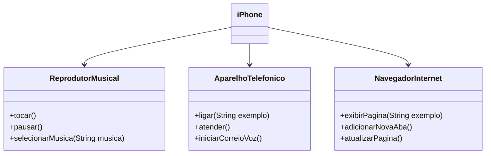

## Projeto Programação Orientada a Objeto

Modelagem e Diagramação de um Componente iPhone

Neste desafio, foi modelado e diagramado a representação UML do componente iPhone, abrangendo suas funcionalidades como Reprodutor Musical, Aparelho Telefônico e Navegador na Internet. Em seguida, foram implementadas as classes e interfaces no formato de arquivos .java.

Funcionalidades modeladas

1. Reprodutor Musical

- Métodos: `tocar()`, `pausar()`, `selecionarMusica(String musica)`

2. Aparelho Telefônico

- Métodos: `ligar(String numero)`, `atender()`, `iniciarCorreioVoz()`

3. Navegador na Internet

- Métodos: `exibirPagina(String url)`, `adicionarNovaAba()`, `atualizarPagina()`

## Diagrama UML

Para esse desafio, foi utilizado Mermaid.

